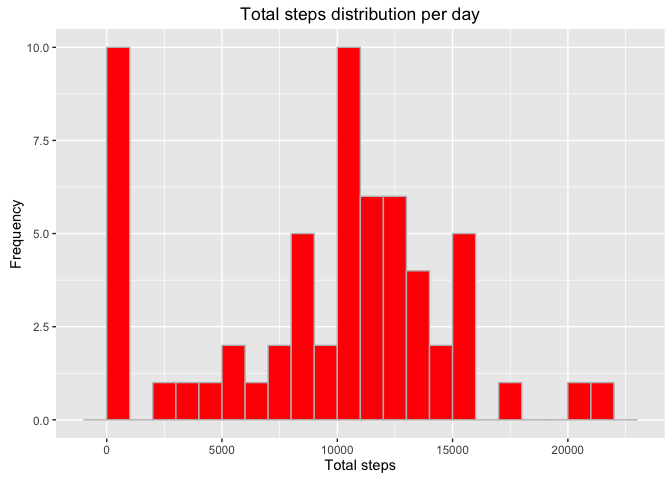
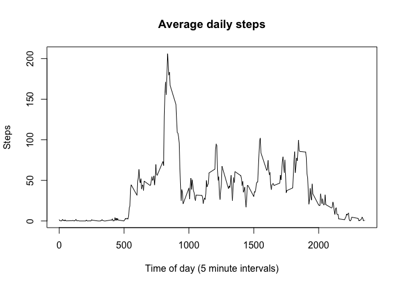
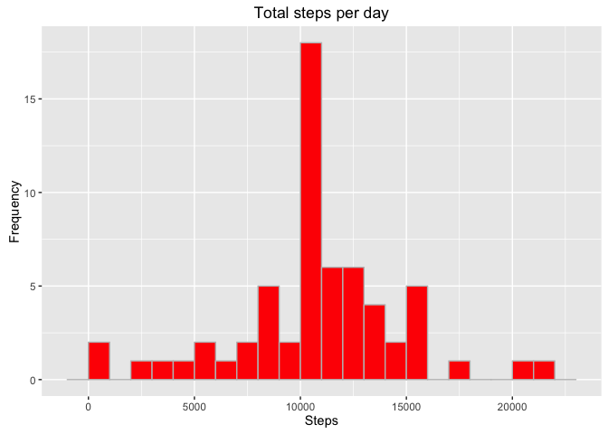
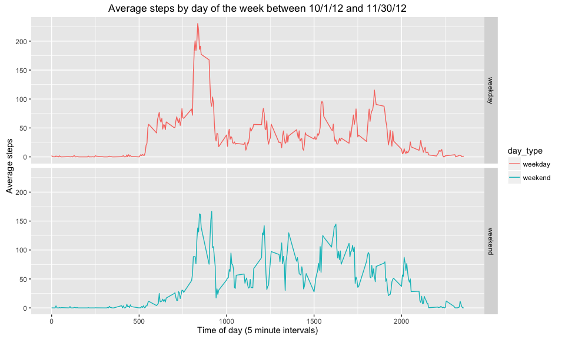

# Reproducible Research: Peer Assessment 1

## Introduction
This assignment is to explore fitbit data counting the steps taken every five minutes per day.

## Loading and preprocessing the data


```r
# 1.
unzip("activity.zip")
activity <- read.csv("activity.csv", stringsAsFactors=FALSE)
str(activity)
```

```
## 'data.frame':	17568 obs. of  3 variables:
##  $ steps   : int  NA NA NA NA NA NA NA NA NA NA ...
##  $ date    : chr  "2012-10-01" "2012-10-01" "2012-10-01" "2012-10-01" ...
##  $ interval: int  0 5 10 15 20 25 30 35 40 45 ...
```

The dates need to be converted from strings to a format recognized by R. We'll bring in the *lubridate* package to help do this quickly.


```r
# Library to format the dates
library(lubridate)

# 2. 
# Formatting the dates
activity$date <- ymd(activity$date)
str(activity)
```

```
## 'data.frame':	17568 obs. of  3 variables:
##  $ steps   : int  NA NA NA NA NA NA NA NA NA NA ...
##  $ date    : POSIXct, format: "2012-10-01" "2012-10-01" ...
##  $ interval: int  0 5 10 15 20 25 30 35 40 45 ...
```

Much better.

## What is mean total number of steps taken per day?


```r
library(dplyr)
```

```
## 
## Attaching package: 'dplyr'
```

```
## The following objects are masked from 'package:lubridate':
## 
##     intersect, setdiff, union
```

```
## The following objects are masked from 'package:stats':
## 
##     filter, lag
```

```
## The following objects are masked from 'package:base':
## 
##     intersect, setdiff, setequal, union
```

```r
# 1.
daily_steps_sum <- activity %>%
  group_by(date) %>%
  summarise(total_steps=sum(steps, na.rm=TRUE))

# 2
library(ggplot2)
```

```
## Warning: package 'ggplot2' was built under R version 3.2.3
```

```r
g <- ggplot(daily_steps_sum, aes(x=total_steps))
g + geom_histogram(fill="red", color="grey", binwidth=1000) +
  xlab("Total steps") + ylab("Frequency") + ggtitle("Total steps distribution per day")
```



It looks like a normal distribution of total steps per day. There's quite a lot of zero steps, which probably has to do with the NAs, but we'll handle that in a moment.


```r
# 3. mean, median steps taken per day
mean(daily_steps_sum$total_steps, na.rm=TRUE)
```

```
## [1] 9354.23
```

```r
median(daily_steps_sum$total_steps, na.rm=TRUE)
```

```
## [1] 10395
```

So the median number of daily steps is 10395 and the average number of daily steps is 9354.2295082.

## What is the average daily activity pattern?


```r
# Creating a new dataframe that calculates the average steps per interval period
timeseries <- activity %>%
  group_by(interval) %>%
  summarise(avg=mean(steps, na.rm=TRUE))

# Plotting out the results
plot(timeseries, type="l", main="Average daily steps", ylab="Steps", xlab="Time of day (5 minute intervals)")
```



```r
timeseries %>% filter(avg==max(avg))
```

```
## Source: local data frame [1 x 2]
## 
##   interval      avg
##      (int)    (dbl)
## 1      835 206.1698
```

The average daily activity pattern varies throughout the day, but most of the activity happens in the morning, probably when the subject exercises.

The peak average time is at 8:35 a.m. when there's an average of 206 steps.

## Imputing missing values


```r
# 1.
sum(is.na(activity))
```

```
## [1] 2304
```

There are 2304 intervals with NAs. 


```r
# 2.
mean(is.na(activity))
```

```
## [1] 0.04371585
```

That's about 4.37 percent of the entire data set.


```r
# Where are the NAs?
blank <- activity %>% group_by(date) %>%
  summarise(NAs = sum(is.na(steps)))
head(blank,10)
```

```
## Source: local data frame [10 x 2]
## 
##          date   NAs
##        (time) (int)
## 1  2012-10-01   288
## 2  2012-10-02     0
## 3  2012-10-03     0
## 4  2012-10-04     0
## 5  2012-10-05     0
## 6  2012-10-06     0
## 7  2012-10-07     0
## 8  2012-10-08   288
## 9  2012-10-09     0
## 10 2012-10-10     0
```

It appears as if the NAs occur on whole days— probably when the subject has forgotten to wear the band.

Let's replace the NAs for on those days with the average for the corresponding intervals.


```r
# Creating an array of days with NAs
blank_only <- subset(blank, NAs>0)
blank_only <- blank_only$date

# Forking the dataframe to edit
activity_adjusted <- activity

# 3. This loop goes through the activity dataframe, searching for a match to one of the days with the NAs. Then it replaces the NAs with the average for the corresponding intervals.

for(i in 1:length(blank_only)){
  activity_adjusted[activity_adjusted$date==blank_only[i],1] <- timeseries$avg  
}
# 4. Recalculate the total steps by date with the imputed steps
daily_steps_sum_adjusted <- activity_adjusted %>%
  group_by(date) %>%
  summarise(total_steps=sum(steps, na.rm=TRUE))

# Charting out the new results
g <- ggplot(daily_steps_sum_adjusted, aes(x=total_steps))
g + geom_histogram(fill="red", color="grey", binwidth=1000) +
  xlab("Steps") + ylab("Frequency") + ggtitle("Total steps per day")
```



Looks different from the chart before, right? There's a higher frequency in the middle of the histogram now. 


```r
mean(daily_steps_sum_adjusted$total_steps)
```

```
## [1] 10766.19
```

The average daily steps is now 1.0766189\times 10^{4}


```r
median(daily_steps_sum_adjusted$total_steps)
```

```
## [1] 10766.19
```
The median number of daily steps is now 1.0766189\times 10^{4} which is higher than it was originally with the NAs.

## Are there differences in activity patterns between weekdays and weekends?

```r
# 1. Add a new column based on the day of the week of the date
activity_adjusted$day <- weekdays(activity_adjusted$date)

# Add another column that fills in 'weekend' or 'weekday' based on what's in the day column
activity_adjusted$day_type <- ifelse(grepl("Saturday", activity_adjusted$day), "weekend", ifelse(grepl("Sunday", activity_adjusted$day), "weekend", "weekday"))

# Convert this to factor
activity_adjusted$day_type <- as.factor(activity_adjusted$day_type)

# Find the average number of steps by interval depending on the two factors
weekdayend <- activity_adjusted %>%
  group_by(day_type, interval) %>%
  summarise(avg_steps=mean(steps))

# 2. Plotting out the results
g <- ggplot(weekdayend, aes(x=interval, y=avg_steps))
g + geom_line(aes(color=day_type)) + facet_grid(day_type~.) +
  ggtitle("Average steps by day of the week between 10/1/12 and 11/30/12") +
  xlab("Time of day (5 minute intervals)") + ylab("Average steps") 
```



The data reveals the disparity in activity between weekends and weekdays. The subject doesn't wake up as early and stays up later. There is not as high as pike in activity on the weekends compared to the weekdays in the mornings but there's consistent activity over the weekend.
